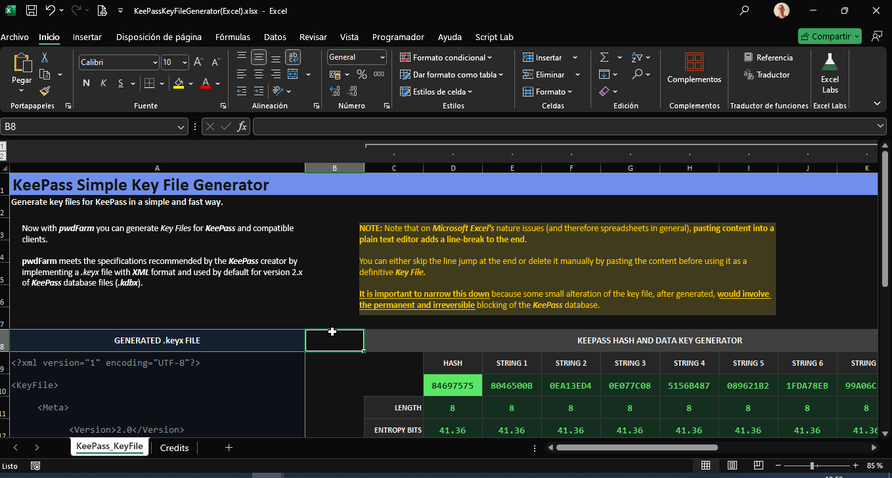

# KeePassKeyFile.ODS
A simple way to generate KeePass KeyFiles in spreadsheets (LibreOffice Calc version).

KeePassKeyFile in LibreOffice Calc / ODS file

KeePassKeyFile in MS Office Excel / XLSX file

No codes. Just spreadsheet formulas. Just select the cells with the generated XML code, copy and paste in your regular text/code editor to save it as a .`keyx` file according to the official [specifications to create key files](https://keepass.info/help/base/keys.html#keyfiles) for KeePass.
