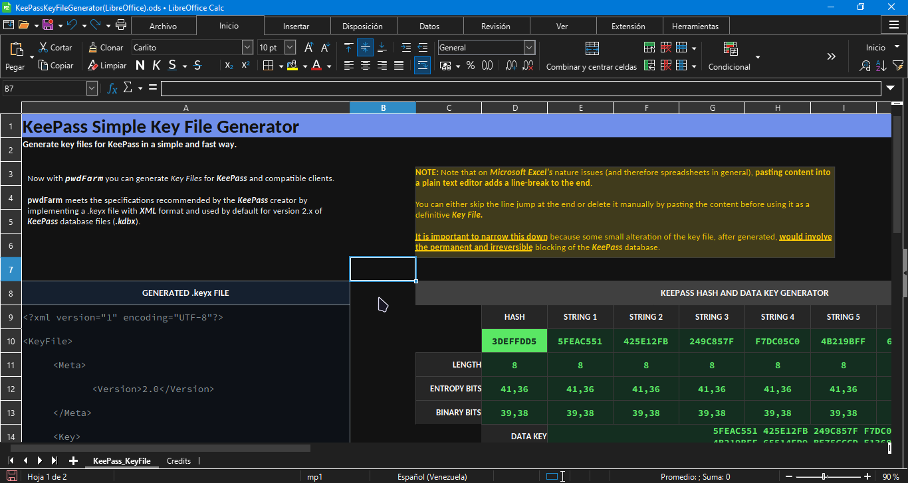

# KeePassKeyFile.ODS
A simple way to generate KeePass KeyFiles in spreadsheets (LibreOffice Calc version).

KeePassKeyFile in LibreOffice Calc / ODS file

KeePassKeyFile in MS Office Excel / XLSX file

No codes. Just spreadsheet formulas.
